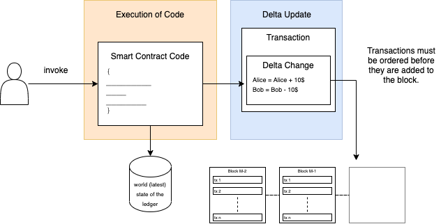

# Eth vs Fab - A Deep dive Comparison - Part 1

> **Caveat Emptor** - If you are looking for a non-technical comparison, this article is not for you. But if you are a ninja ⚔️ developer or a fledgeling 🐦 one, this is the right place to understand the internals of the platforms side-by-side.  

In this article, we deconstruct some of the similarities and differences between two of the most popular Blockchain Platforms - Hyperledger Fabric v2 and Ethereum v1 (as of 10th Oct 2020). The motive is simple. We have much material explaining the workings of each of these ledger platforms. However, there still does not exist a deep-dive comparison of these ledger platforms. 🧐

Most ledger platform comparisons that I have stumbled discuss core features of the platforms like Consensus, Permissioning, smart contract language, and the likes. Personally, as a technology geek and a person who likes to dive deep and ask a lot of questions, these articles do not quench my thirst. 😅🍺

So, as an aspiring Software Architect, I decided to make an attempt to understand these platforms deep and explore the fundamentals that make these Platforms tick and what claims the fame of these ledger platforms. 

I attempt to explore the architecture in four distinct areas. The overall functions that these ledger platforms provide, the architectural characteristics (also known as the non-functional requirements (NFRs)/ Quality Attributes / "ilities") that these functions are expected to exhibit, the architectural topology or simplified view, and finally some of the critical architectural decisions that were considered. 

This will be a six-part series of articles where I will attempt to take each of the fundamental concepts of a Blockchain Platform and attempt to expound them as it is architected in each of the platforms with the rationale behind it. I will also try to provide an essence of the key architectural considerations made while designing the platforms. 

I will try to explore the following areas, and in each, I try to cover three fundamental aspects. First is the need, second is key architectural considerations and finally the comparison. My goal is to be objective and non-partisan. For this, I will share the references to the sources from where I have obtained and compiled the information. 

## Comparison Areas

| Area | Covered In |
|------|------------|
|Overall Architecture|Part 1|
|Block Architecture|Part 2|
|Ledger & Storage|Part 2|
|Identity Management|Part 3|
|Transaction Lifecycle|Part 4|
|Smart Contracts & Ledger State|Part 4|
|Consensus Process|Part 5|
|Security|Part 6|
|Confidentiality|Part 6|

## Overall Architecture of Hyperledger Fabric vs Ethereum
---
### Distributed Systems 101
---
In this section, I attempt to break down the fundamental cogs that drive the Fabric Blockchain Operating system from the Ethereum Blockchain Operating system. Although mouthful it may sound, both of these platforms are irrefutably distributed in nature first - then decentralized. Hence all principles of distributed systems apply here. I believe it is fundamental to reason from the first principles of these. 

If you are not too familiar with distributed system principles, I cannot recommend [this](http://book.mixu.net/distsys/single-page.html) article enough for a quick reckoner on Distributed systems. 

But let me take a quick plunge into the **fundamentals of distributed systems**:

- Distributed systems are composed of nodes or computers that are capable of computing (calculating), storing, and transmitting data.
- These computers are *Unreliable* and so are the *communication channel(s)* that connect them. Any or both can crash or malfunction at any point in time. 
- Distributed systems do not have a global clock. Ever tried setting two electronic clocks precisely to the second (do it with two computers to the millisecond).
- Distributed systems are complicated. One simply does not design a distributed system if there was a monolith computer with infinite compute and storage.
- All systems are eventually intended to cater to Functional and Non-Functional needs. Non-Functional needs a.k.a. Quality Needs. Basic quality needs of any distributed system include Scalability, Performance, Availability, and Fault Tolerance.
- For reliability and availability, one needs to replicate data. Where there is replication involved in distributed systems, the famous CAP theorem applies. It says that you cannot have all three properties in a distributed system (which replicates data) at the same time, i.e. Consistency, Availability and Partition Tolerance. Try achieving any two, and you have to trade-off the other.  

Let us start with the needs of a Blockchain Platform, discuss the rationale behind the architectural characteristics. 

#### Need: **State Machine Replication**

Any blockchain system is fundamentally a distributed database in the most simple terms. It needs to be consistent, that means all data in all the computer nodes has to exactly be the same. Note here, I am not emphasizing on time here. Consistency can be immediate or eventual. To replicate the state of the database, State Machine Replication is used. There are two ways to do replication. Active Replication and Passive Replication. Active replication is where every database server processes the request in a deterministic way (i.e. everyone produces the same output on a single input). To guarantee that all servers produce the same output it has to be ensured that all servers receive all the inputs in the exact same order. This is ensured by *Atomic Broadcast*. Atomic Broadcast says that the input should be received either by all servers or none. 
Passive replication is more of a *dictatorial* in nature, which means that there is one master server executing the request and updates other servers with the execution result without blocking the client request. 

#### Need: **Smart Contract Execution or Agreement on the outcome of a business logic**
Second-generation blockchain platforms work on the outcome of Smart Contracts, which is the custom business logic for determining the outcome of the transaction. However, there are subtleties involved here, and they are:

- *Who needs to execute the smart contracts and why is there a need to agree on the outcome?* 
- *What goes inside the ledger?*
- *Is the agreement on the smart contract outcome different from the State Replication itself?*

Let us try to answer these fundamental questions subjective to each ledger platform.

#### ***Who needs to execute the smart contracts and why is there a need to agree on the outcome?*** ####

Users who do not usually trust each other on the outcome of a transaction executes the smart contract. This helps one to verify the outcome is genuinely computed and has not been tampered. This dates back to the fundamental underpinnings of Bitcoin and cryptocurrency. Bank serves as the trusted arbiter to hold account balances for everyone. All banks universally operate on the same set of rules to maintain account balances. But if a nation or government or bank goes rogue, then what? This where secure computation comes into the picture. Smart contract execution ensures that every bank (hypothetically) executes the same logic and matches the outcome. 

Note the subtlety in the last line? Every bank needs to execute the contract to agree on the outcome. So, does this mean that a civilian like you or me should compute the outcome for every other transaction? Probably no. Why should you be concerned about a transaction happening between other parties? But Bitcoin and Ethereum enforce this. It mandates that all participating nodes must agree on the outcome of the transaction, even if one is not involved in the transaction. 

Moreover, there is not any need to bring store the transaction outcomes as well. This is the inception of the concept of Permissioned and private Blockchain platforms. So, if we delve into this a bit deeper, we would realize that:

1. Not everyone needs to store all transactions, and others would not be comfortable with sharing the data.
2. Even a lesser proportion of the population would be requiring to actually execute a transaction and agree on the outcome. 
3. Comparing 1 & 2, we can realize that there would be people who would just be observers who are interested in storing the agreed outcome but not executing the transaction itself.

So we can deduce that the state machine replication should be separated from the agreement on the outcome of the transaction by Smart Contract execution. 

#### **What goes inside the ledger?**

The ledger should be composed of all the outcomes of transactions checkpointed using a specific mechanism called blocks, unlike databases, where checkpoints are granular to the level of transactions itself. Checkpoints in Blockchain are Blocks which comprises the transactions. 

The ledger then should contain all the delta updates (as transactions) that happened to the database checkpointed as blocks. Nodes in the network can either choose to store an irrefutable record of data and consent on the outcome of transactions (by executing smart contracts on the ledger data) or just choose to store data as an observer, like a bank computer vs a bank vault. The ledger is merely the bank vault.

#### **Is the agreement on the smart contract outcome different from the State Replication itself?**

This is a question related to the previous one. And the answer is yes. Everyone interested to agree on the outcome of the transaction needs to have an irrefutable copy but so do people who are just interested in a copy of the ledger. So, the State Machine Replication is what guarantees that all interested parties would get the exact replica of the ledger. 

Now, that we have established some fundamentals, we must realize that when we perform a transaction, we want both the steps to happen atomically (all or none). That means that relevant parties should agree on the outcome of the smart contract execution, and the appropriate parties should get a replica of the outcome of the transaction. 

#### **Differences Between Ethereum and Hyperledger**

As we know Ethereum is famous for both dApps (i.e. it's the capability to host decentralized apps, leveraged by smart contracts) as well as it's acclaimed cryptocurrency. The backbone of trust in Ethereum is its backed cryptocurrency that allows to codify game-theoretic security and innoculate trust in the dApps. Likewise, the backbone of trust in Hyperledger platform is the consortial identity binding. 
In other words, the idea of trust is backed by some stake (like money, reputation, something that is dear to someone). In a public blockchain network which aims to be secure and conserve the privacy of the individual, money is at stake. In contrast, in a permissioned (i.e. known environment), the identity or the reputation is at stake. 

So, in a public network, to maintain the cryptocurrency or to enable cryptocurrency backed trust all participants must host the ledger and run the base cryptocurrency codebase. And since the cryptocurrency is not bounded, its scope mandates every participant to run all the smart contracts ever hosted on the ledger. This essentially means that if you want to do transactions on the ledger, backed by crypto trust, you have to vet not only who owns how much cryptocurrency but the transactions that alter the balances of the cryptocurrency as well - in this case, smart contract transactions. 

But in a permissioned network, participants are known to each other (i.e. the identity and reputation are at stake). So a rogue actor would think twice before ruining its own reputation. 
This gives a differentiating (edge) factor to permissioned chains. In the early days, communities used to serve the function of law and order. This is because the individuals of a community were tightly knit within that community, and the transactions were strictly within the community. As Globalization became more prevalent and transactional boundaries widened, central law and order became the need of the hour. A similar concept applies to consortial and public blockchain platforms. 

Let us explore how these distinct requirements shaped the architecture of both the ledger platforms.

1. **Order-Execute vs Execute-Order-Validate**

This title "Order-execute vs Execute-Order-Validate" is borrowed from the official [Hyperledger Fabric paper](https://dl.acm.org/doi/10.1145/3190508.3190538). Although I do not fully agree with the semantics, I still choose to borrow it for better relatability.

Ethereum blockchain and as a matter of fact, every machine that follows state machine replication has to order transactions. A transaction, in this case, is whatever changes the current state of the system. The state in the ledger is determined by the outcome of the transactions. The transactions generate some *delta change* in the state that gets appended to the block and hence modifies the world state of the transaction. The same is true for Hyperledger Fabric as well. But the difference lies here. Hyperledger Fabric has decoupled the generation of the *delta change*. This is the fundamental difference. 

The execution of the code (i.e. Smart Contract code) is different from the commitment of the delta updates (i.e. inclusion of the transactions in the ledger). This is a fundamental difference that affects the performance and scalability of a Blockchain platform. The execution of the code coupled with the committing of the verification mandates every node execute the smart contract. 

> TODO Update

I like to emphasize that this coupling is very much necessary in subjective contexts. In Ethereum Blockchain, this coupling ensures that all nodes agree on the ledger state (sounds familiar, yes I am talking about Consensus, which I will cover in detail later in the series). 

The validation of the block which includes of the smart contract execution by all notes (including the miner) generates the output state of the ledger as per the transactions sequentially executed. Note here that the transaction execution 

ensures that the smart contract executes correctly is fundamentally different from the one that generates the output states. 

[Ethereum Whitepaper](https://ethereum.org/en/whitepaper/)

The state of the ledger is synchronized using the relevant Gossip Protocol which ensures that the state of the ledger is in sync with other nodes in the network. The state transition as a result of the transaction happens 

