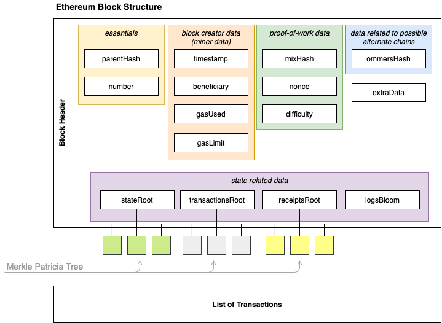

## Introduction

Thank you for the overwhelming response to the first blog post on the rationale exploration for Blockchain Platform Architecture. In the first part I discussed about the basics of Distributed systems and their unreliability. However, when dealing with any system, the architectural characteristics play a vital role in determining the quality of the system. The ISO 25010 sets the standards of the quality characteristics can exhibit.

Performance and Scalability are two of the keystone qualities that make any large scale systems usable. Remember, if we had a large computer with infinite resources, then there would not be any distributed systems. So, distributed systems, being so, must be always performant and should scale so as not run out of business.

However, a performant and scalable distributed system is anything but easy. There are a myriad of techniques for inoculating performance and scalability, each one always costing you something. Hybrid approaches do seem work but at the cost of complexity and manageability.

## Enter the Block

Scale and Performance in a Blockchain no matter how complex and diverse a topic can be, always starts with the Block. Why?
Because it is the fundamental unit in a Blockchain, that packs transactions. Imagine it like a medium to perform State Machine Replication of the database. It is the same economics of flying in business class versus economy.
The difference is in the number of round trips that happen when transactions needs to be synced across node. Lesser the round trips, the more economical it becomes. The block can contain transactions in the form of state changes. Each state change can be thought of a set of key-value pairs proposed by users packed into a logical entity called a transaction.

## Stitch 'em in a Chain

So why do we need a chain of Blocks? A chain of blocks is a way to determine integrity of the data on the network. We all are familiar with the dynamics of how a merkle hash tree works. It works on the magic of trapdoors and randomness of Hash Functions. These characteristics are extremely crucial in how we perceive the characteristics of Blockchain. The chain in the literal sense signify the permanence of data that is built using a form a singular thread of a Merkle tree where the root of the Merkle tree is always the latest block, and there is one irrefutable leaf node and multiple leaf nodes which stay as leaf because no one decided to mine on them. In case of permissioned blockchains like Hyperledger Fabric, the leaf node is always the genesis block.

Ultimately, the purpose of the hash to establish a singular path from the leaf with the root ever growing outwards.

To give the essence of Blockchain's immutability, a block should capture the essence of the immutability. The hash function captures that. We all know that every block contains the hash of the previous block and how difficult it is to alter the hash of the block. But wait; is that all? How do we take the hash? Just pile up all the data and transactions (concatenate them) and take the resultant hash?

- Option A - hash all the data concatenated together
- Option B - Use merkle trees

While both seem feasible, but virtually all the blockchain platforms use option B. You may be wondering why?

## Merkle Trees...The name seems familiar

While blockchains are disgraced for encumbering nodes with all data from inception, it is not always the case that blockchains are purely fueled by full nodes. Full nodes, like big brothers carry the load of the network by downloading all data from the network and validating transactions. But light nodes (of Ethereum and Bitcoin) work on the mechanism of Merkle Proofs.

While piling up all the data side by side may work for the purpose of immutability, it is not efficient when it comes to light clients.
Light clients work on a concept of Merkle Proofs that leverage the incremental build up of the hash of N elements to determine the presence of a transaction inside a block. Merkle proofs provide a lightweight mechanism that enables the light clients (who do not store the whole blockchain data) to verify the presence of transactions with a tiny fraction of  the actual block data. This enables the light clients to run in sync with the full nodes while verifying blocks only with headers and obviating the need for full scale verification.

The way Merkle proofs work is based on a neat scheme devised by famous computer scientist Ralph Merkle. The scheme involves creating a binary tree of data present at the leaf level, where each leaf is hashed to give the next level of nodes. Here onwards, a pair of data is concatenated and hashed to form its parent. This is carried on until there is a single root called the Merkle root. The Merkle root forms the single hash representing the whole data.

To verify the presence of a single data element, one does not need all the leaf nodes to calculate the root. By selecting a special path called the Merkle proof corresponding to a leaf node (or element in question to be verified), this mechanism enables lightweight verification of the element. Just select all the non-leaf nodes which are the ommer (parent's sibling) nodes starting with the element, and then recursively until you reach the root. The nodes that path followed is the Merkle Proof of the element to be verified.

So imagine if there are N elements to be stored, the proof would be as long as the depth of the tree, i.e. log(N).

//TODO add diagram here

Vitalik Buterin has explained this concept in [this article](https://blog.ethereum.org/2015/11/15/merkling-in-ethereum/). I highly recommend reading it highly.

Although things in the Fabric world are not different in terms of using Merkle Trees, fabric does not have a concept of light clients. The reason Merkle Trees why Fabric adopts Merkle trees are for optimizing data storage on chain. For example, range queries supported by fabric chaincode uses Merkle trees to optimize storage of a range of read keys.

So, now that we have questioned about a few fundamentals about Blockchain. Let us discuss about state and why it is important.

## Blockchain was enough. Now why this State?

The state is the snapshot of the ledger from inception till now. Let us come back to the famous example of chess. The ledger is the list of all the moves that you and your friend made till the start of the game. But the state is how the board looks since the last move was played. The state gives a way to interpret the status of all the transactions that happened since the inception of the chain. Without the state, to know Alice's balance one has to read all the transactions from the inception to know the current state of her account balance - which is extremely inefficient. The state can be thought of as a set of key-value pairs at their latest state checkpointed using a version number.

## The Block Recipe

When talking about the fundamental structure of a block, there are a few basics that all block based ledgers follow. The block would essentially consist of three things:

1. The list of transactions
2. The hash of the previous block
3. The block number

In addition to this basic structure, each block holds special information about the accountability. Accountability metrics answers the WHO of the block.

- Who sent the transactions?
- Who proposed the block or the block creator?

These metrics for accountability play a key role in the security of the blockchain. The sender of the transaction needs to be identified for obvious reasons. However the block proposer needs to be identified for incentivizing or penalizing the block creator. In the last post we discussed the need for stakes. And since in a block creation mechanism, there needs to be a leader, identifying the leader is imperative to maintain the sanity and security of the network.

## Block Structure Compared

Let us look at an oversimplified view of the block for Ethereum & Hyperledger Fabric.

### Ethereum Block Structure

When it comes to Ethereum, being a public blockchain platform has a lot of block data. The header of the block in Ethereum contains three basic elements

- **the essentials** - the parent block hash and the block number
- **block creator data** - details about the block creator, the reward information, the total gas expenditure, the total gas limit imposed